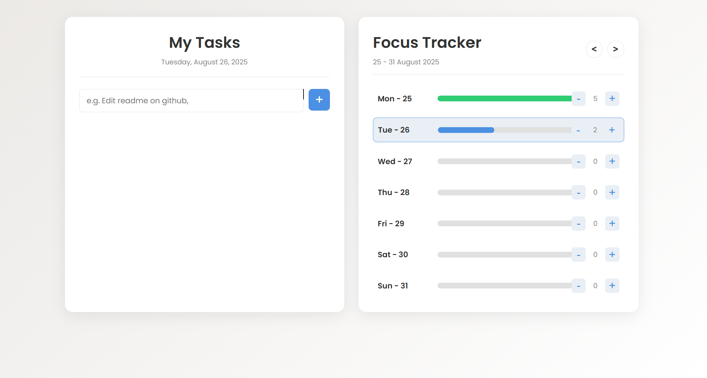

# Productivity Dashboard - A Vanilla JS Application

[](https://opensource.org/licenses/MIT)

A clean and modern dashboard featuring a To-Do List and a Weekly Focus Tracker. This project is built entirely with vanilla HTML, CSS, and JavaScript, demonstrating core web development concepts without any frameworks. All data is saved locally in your browser using `localStorage`.

**[➡️ View Live Demo](https://pucio8.github.io/productivity-dashboard/)**


## ✨ Features

This application combines two essential productivity tools in a single, responsive interface:

### To-Do List
- **Add Tasks**: Quickly add new tasks through a simple input form.
- **Delete Tasks**: Remove completed or unwanted tasks with a single click.
- **Data Persistence**: Your task list is automatically saved and reloaded on page refresh.

### Weekly Focus Tracker
- **Track Sessions**: Log your focus or work sessions for each day of the week.
- **Unlimited Tracking**: Add as many sessions as you need—the counter is not limited.
- **Visual Progress**: A dynamic progress bar fills up as you log sessions, turning green when you reach your goal (5+ sessions).
- **Full Week Navigation**: Easily navigate to past and future weeks to review your progress over time.
- **Data Persistence**: Your entire weekly history is saved in `localStorage`.

## 🛠️ Tech Stack

- **HTML5**: For the structure and content.
- **CSS3**: For modern styling, including Custom Properties (Variables), Flexbox, and Grid.
- **Vanilla JavaScript (ES6+)**: For all the application logic, DOM manipulation, and event handling.

## 🚀 How to Use

1.  **Clone the repository:**
    ```bash
    git clone [https://github.com/pucio8/productivity-dashboard.git](https://github.com/pucio8/productivity-dashboard.git)
    ```
2.  **Navigate to the project directory:**
    ```bash
    cd productivity-dashboard
    ```
3.  **Open `index.html` in your browser.**

That's it! The application is fully client-side and requires no build steps or dependencies.

## 🤝 Contributing

Contributions, issues, and feature requests are welcome! Feel free to check the [issues page](https://github.com/pucio8/productivity-dashboard/issues).