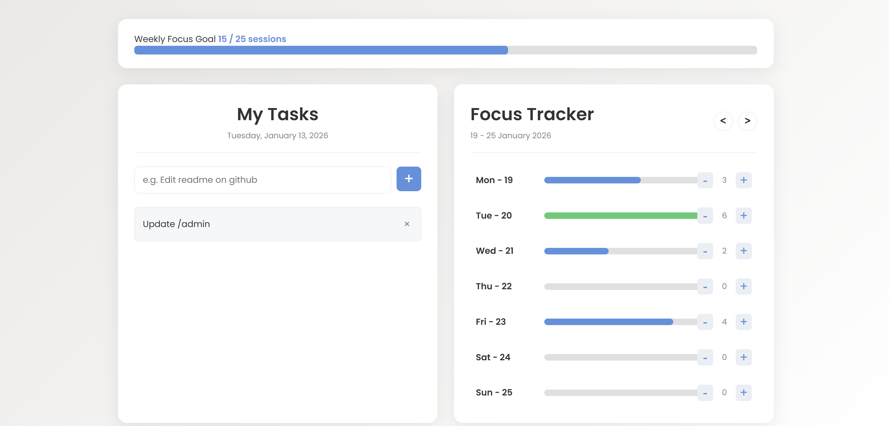

# 🚀 Productivity Dashboard (v1.2.0)

[](https://opensource.org/licenses/MIT) [](#installation--pwa) 

A sleek, modern dashboard featuring a To-Do List and a Weekly Focus Tracker. Built with pure Vanilla JS and now upgraded to a **Progressive Web App (PWA)** with gamified celebrations.

**[➡️ View Live Demo](https://pucio8.github.io/productivity-dashboard/)**



## 🌟 What's New in v1.2.0?
- **PWA Support**: Install the dashboard as a native app on your desktop or mobile device.
- **Weekly Focus Goal**: A new top-level progress bar to track your 25-session weekly milestone.
- **Gamified Celebrations**: Interactive confetti effects powered by `canvas-confetti` when reaching goals.
- **Modern Layout**: Improved UI with a full-width summary and side-by-side columns.

## ✨ Features

### To-Do List
- **Persistent Tasks**: Add and delete tasks; everything stays in your `localStorage`.
- **Date Display**: Automatically tracks and displays the current date.

### Weekly Focus Tracker
- **Daily Goals**: Reach 5 sessions a day to turn your progress bar green and trigger a celebration burst 🎉.
- **Weekly Goal (25 sessions)**: Track your overall weekly effort with a new global progress bar and a grand fanfare upon completion 🏆.
- **Time Travel**: Navigate through weeks to review your historical focus data.

## 🛠️ Tech Stack

- **Frontend**: HTML5, CSS3 (Grid & Flexbox).
- **Logic**: Vanilla JavaScript (ES6+).
- **PWA**: Service Workers & Web Manifest for offline support and installation.
- **Animations**: [Canvas-Confetti](https://www.npmjs.com/package/canvas-confetti) for celebration effects.

## 🚀 Installation & PWA

1. **Web**: Just visit the [Live Demo](https://pucio8.github.io/productivity-dashboard/).
2. **Desktop/Mobile**: 
   - On Chrome/Edge: Click the "Install" icon in the address bar.
   - On iOS: Tap "Share" and select "Add to Home Screen".
3. **Local Dev**:
   ```bash
   git clone [https://github.com/pucio8/productivity-dashboard.git](https://github.com/pucio8/productivity-dashboard.git)
   cd productivity-dashboard
   # Open index.html in any browser

## 💾 Data Persistence
    
    This application uses LocalStorage. No account or database is required; all your data stays privately on your device.